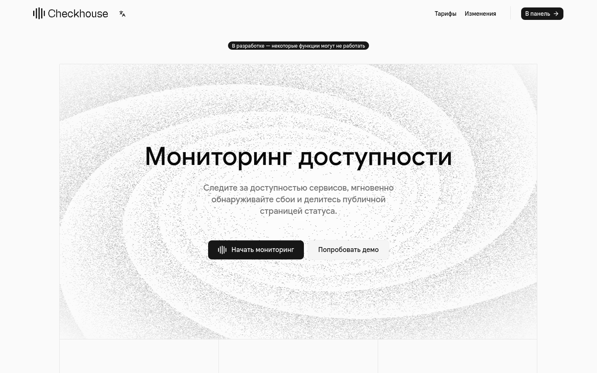

# Checkhouse
Мониторинг сайтов.
Ваш сайт под нашим присмотром, мониторинг сайтов, статус страницы.

Мониторы:
- HTTP
- TCP
- DNS

Есть возможность указывать ожидаемые ответы на проверки, например:
```typescript
// Для DNS
{
  assertions: [
    {
      record: "CNAME",
      comparator: "INCLUDES",
      target: "..."
    }
  ]
}
```

В таком случае, если при проверке будут выполнены все `assertions`, тогда проверка получит статус - `ok`, 
если проверка займет больше времени чем ожидается, тогда статус будет - `degraded` 

Для http будет больше вариантов для проверки, например по заголовкам, статусу, и позднее по телу ответа.
